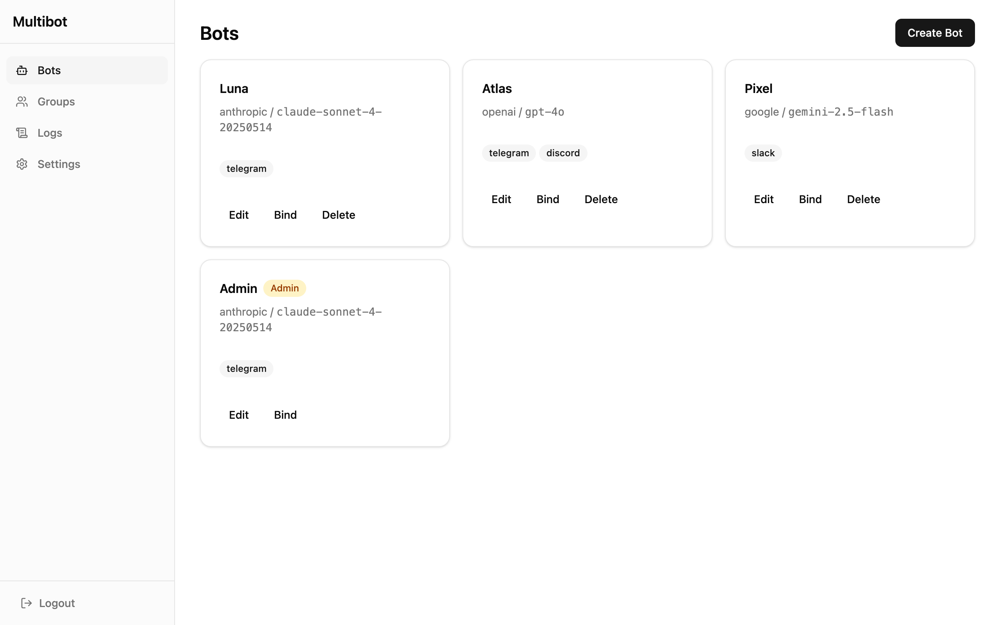
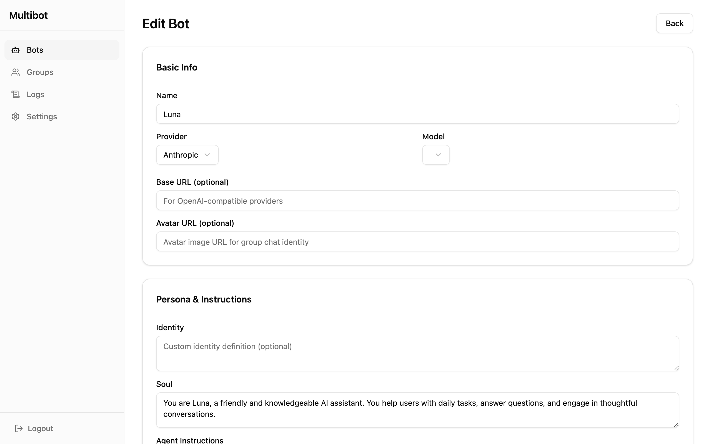
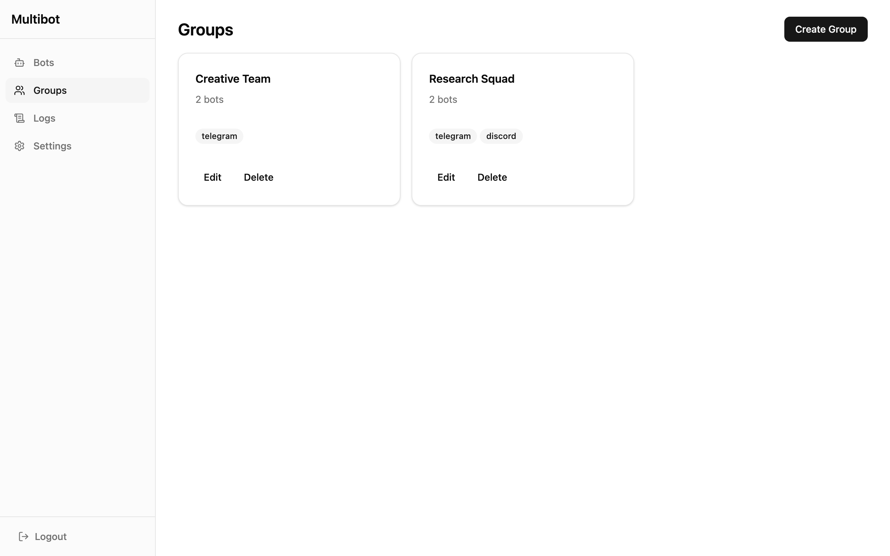
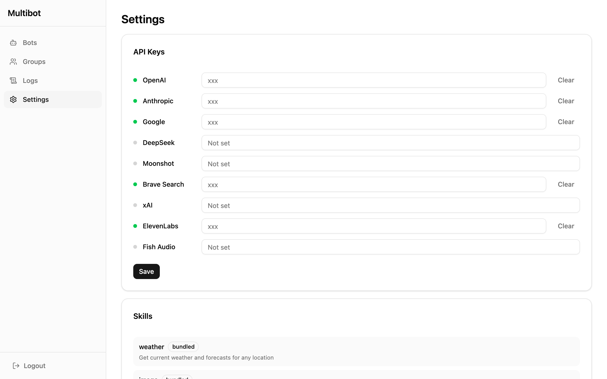

# multibot

A fully serverless, multi-bot AI platform that runs on Cloudflare edge. Create, configure, and manage multiple AI bots through a web dashboard -- connect them to Telegram, Discord, or Slack with one click.

[](LICENSE)
[](https://nodejs.org/)

## Feature Highlights

### Fully Serverless, One-Click Deploy

Runs entirely on Cloudflare edge (Workers + Durable Objects). No servers to manage, scales automatically.

### Low Cost

Starting at $5/month with pay-as-you-go pricing. No DevOps overhead.

### Multi-Bot Group Chat

Multiple AI bots collaborate in group conversations, coordinated by an orchestrator.

### Memory

Two-layer architecture (MEMORY + HISTORY) with LLM-driven consolidation. Bots remember context across conversations.

### Skills

Markdown-driven skill system with progressive loading. Extend bot capabilities without code changes.

### Voice

Speech-to-Text (Cloudflare Workers AI Whisper) and Text-to-Speech (OpenAI TTS). Talk to your bots naturally.

### Scheduling

One-shot, interval, and cron expressions with timezone support. Bots can run tasks on their own schedule.

## Dashboard

| Bot Management | Bot Configuration | Group Chat | Settings |
|:-:|:-:|:-:|:-:|
| [](docs/screenshots/bot-list.png) | [](docs/screenshots/bot-edit.png) | [](docs/screenshots/groups.png) | [](docs/screenshots/settings.png) |

## Quick Start

### Prerequisites

- [Node.js](https://nodejs.org/) 20+
- [Cloudflare account](https://dash.cloudflare.com/sign-up) with Workers Paid plan ($5/mo for Durable Objects & Cron Triggers)
- [Fly.io Sprites](https://sprites.dev) API token (for bot sandbox -- shell & file tools)

### Setup & Deploy

```bash
git clone https://github.com/codance-ai/multibot.git
cd multibot
./scripts/setup.sh    # installs deps, logs in to CF, creates all resources
npm run deploy        # builds dashboard + deploys worker
```

`setup.sh` handles everything: installs dependencies, logs in to Cloudflare (opens browser), creates D1/R2 resources, auto-detects your account email and workers.dev subdomain, and generates `wrangler.toml` (gitignored).

### After Deploying

Open `https://multibot.<your-subdomain>.workers.dev`:

1. **Add LLM API keys** -- Settings page, supports multiple providers
2. **Create a bot** -- name, system prompt, model, skills
3. **Bind a channel** -- connect Telegram, Discord, or Slack

### Optional: Dashboard Auth

Set `DASHBOARD_PASSWORD` and `OWNER_ID` as Worker secrets to protect the dashboard with password authentication:

```bash
echo "your-password" | npx wrangler secret put DASHBOARD_PASSWORD
echo "your-owner-id" | npx wrangler secret put OWNER_ID
```

### Development

```bash
npm run dev       # local dev server
npm test          # run all tests
npm run deploy    # build dashboard + deploy worker
```

## Architecture

```
Telegram ──┐
Discord  ──┼── Gateway (Worker) ──► Durable Object (Agent) ──► LLM Provider
Slack    ──┘   token → botId        per conversation            OpenAI / Anthropic / Google / ...
               chatId → agent       memory, tools, skills
                                         │
                                    Sandbox (Sprites)
                                    shell, filesystem
```

| Concept | Description |
|---------|-------------|
| **User** | Platform user, owns bots, manages LLM API keys |
| **Bot** | AI assistant with its own prompt, model, skills config |
| **Channel** | Chat platform binding (Telegram / Discord / Slack) |
| **Agent** | Runtime instance (DO), one per `{botId}-{channel}-{chatId}` |
| **Sandbox** | Linux sandbox, one per bot, for shell/file tools ([Fly.io Sprites](https://sprites.dev)) |

## License

MIT
